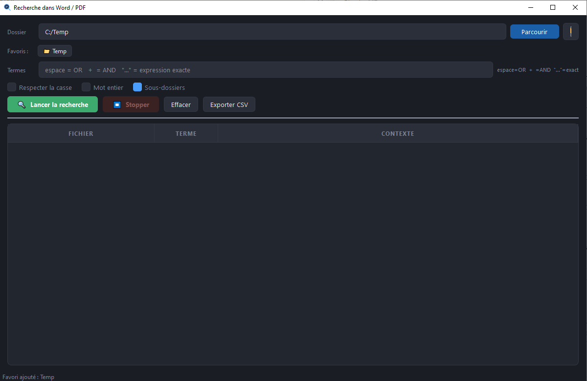

# Search Doc Tool

Outil de recherche de termes dans des fichiers Word (.docx) et PDF, avec une interface graphique moderne en mode sombre.



## Fonctionnalités

- Recherche dans des fichiers `.docx` et `.pdf` (récursivement ou non)
- Syntaxe de requête avancée :
  - Mots séparés par des espaces → mode **OU** (au moins un terme)
  - Opérateur `+` → mode **ET** (tous les termes présents dans le fichier)
  - `"phrase exacte"` → recherche de la phrase littérale
- Recherche insensible aux accents par défaut
- Options : sensibilité à la casse, correspondance sur mot entier
- Affichage du contexte autour de chaque occurrence (terme mis en évidence)
- Numéro de page pour les PDFs
- Export des résultats en CSV
- Système de favoris pour les dossiers fréquents
- Recherche multi-threadée (l'interface reste réactive) — ~500 fichiers / 600 Mo traités en environ 3 minutes
- Version avec index SQLite FTS5 pour des recherches quasi-instantanées sur les dossiers déjà indexés

## Prérequis

- Python 3.12+
- Dépendances :

```bash
pip install PyQt6 python-docx pymupdf
```

## Lancement

```bash
# Interface avec index SQLite FTS5 (recherches rapides)
python search_tool_qt_fts.py

# Interface sans index (recherche directe dans les fichiers)
python search_tool_qt.py

# Interface alternative Tkinter
python search_tool_tkinter.py
```

## Utilisation

1. Sélectionner un dossier contenant les documents à parcourir
2. Saisir un ou plusieurs termes dans la barre de recherche
3. Lancer la recherche — les résultats s'affichent en temps réel
4. Double-cliquer sur un résultat pour ouvrir le fichier :
   - **PDF** : ouvre à la page correspondante (SumatraPDF ou Adobe Reader)
   - **DOCX** : copie le contexte dans le presse-papiers pour un Ctrl+F rapide

Les dossiers fréquemment utilisés peuvent être sauvegardés dans les **favoris** (clic droit pour renommer ou supprimer).

## Index SQLite FTS5 (`search_tool_qt_fts.py`)

La version FTS5 maintient un index local pour accélérer les recherches sur les dossiers déjà parcourus.

- Cliquer sur **"Indexer le dossier"** pour indexer le dossier courant — l'indicateur affiche le nombre de fichiers indexés (`✅ Index à jour` ou `⚠ N/M indexés`)
- Les recherches suivantes utilisent l'index FTS5 pour les fichiers déjà indexés, et la recherche directe pour les autres
- L'index est **global** (partagé entre tous les dossiers) mais les recherches sont toujours filtrées au dossier sélectionné
- Les fichiers sans texte extractible (PDFs scannés, fichiers protégés) sont marqués comme traités et ne sont pas retentés
- L'index est stocké dans `.data/search_tool_index.db` dans le dossier de l'application

## Configuration

La configuration est sauvegardée automatiquement dans `~/.search_tool_config.json` (dernier dossier utilisé, favoris).
