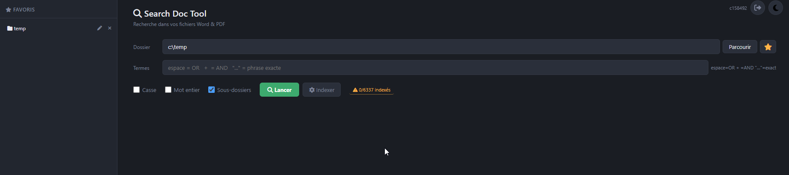
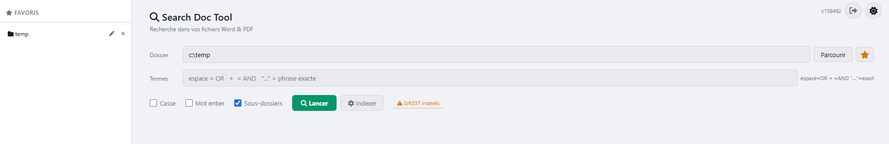

# Search Doc Tool

Outil de recherche de termes dans des fichiers Word (.docx) et PDF. Disponible en application bureau (PyQt6) et application web (Django).

### Application web

| Mode sombre | Mode clair |
|---|---|
|  |  |

## Fonctionnalités

- Recherche dans des fichiers `.docx` et `.pdf` (récursivement ou non)
- Syntaxe de requête avancée :
  - Mots séparés par des espaces → mode **OU** (au moins un terme)
  - Opérateur `+` → mode **ET** (tous les termes présents)
  - `"phrase exacte"` → recherche de la phrase littérale
- Recherche insensible aux accents par défaut
- Options : sensibilité à la casse, correspondance sur mot entier
- Affichage du contexte autour de chaque occurrence (terme mis en évidence)
- Numéro de page avec lien direct vers la page dans le visualiseur PDF
- Barre latérale de favoris pour les dossiers fréquents (par utilisateur, redimensionnable)
- Index SQLite FTS5 pour des recherches quasi-instantanées sur les dossiers déjà indexés
- Indexation en arrière-plan avec barre de progression et bouton d'arrêt
- Bascule thème clair/sombre

## Application web — fonctionnalités supplémentaires

- Multi-utilisateurs : authentification Django (connexion requise)
- Index partagé par dossier : un index par chemin de dossier, partagé entre tous les utilisateurs
- Conversion DOCX → PDF via LibreOffice à l'indexation
- PDF affiché en ligne avec les termes trouvés surlignés
- Statut d'indexation persisté en base de données (survit aux redémarrages serveur)
- Indexation robuste : détection de job bloqué, reprise automatique après arrêt inattendu
- Favoris organisables en dossiers (créer, renommer, supprimer, glisser-déposer entre dossiers)
- Alias sur les favoris : nom d'affichage personnalisé par dossier (le chemin complet est affiché par défaut)
- Suivi des fichiers non indexables : les fichiers en échec (protégés par mot de passe, erreur de lecture) sont signalés séparément dans le badge (ex : "392 indexés • 6 non indexables")
- Recherche optimisée sur les grands corpus : les fichiers indexés sont interrogés directement depuis la base FTS5 (aucune lecture disque), les non-indexés passent par la lecture PDF
- **Outils superutilisateur :**
  - Configuration des dossiers autorisés pour le navigateur de fichiers (les utilisateurs ne peuvent pas naviguer en dehors de ces chemins)
  - Nettoyage des données orphelines : suppression des répertoires `.data/folders/` non référencés par aucun favori

## Prérequis

- Python 3.12+
- **Application web uniquement :** LibreOffice installé (conversion DOCX → PDF à l'indexation)
- **Application web — fortement recommandé :** Microsoft Word installé sur le serveur. L'automatisation COM Word est utilisée en priorité (plus rapide et meilleure fidélité) ; LibreOffice prend le relais en cas d'indisponibilité ou d'échec.

## Installation et lancement

### Bureau (PyQt6)

```bash
cd desktop
python -m venv venv
venv\Scripts\activate
pip install -r requirements.txt
python -m search_tool
```

### Web (Django) — développement

```bash
cd web2
python -m venv venv
venv\Scripts\activate
pip install -r requirements.txt
cd search_tool_project
python manage.py migrate
python manage.py createsuperuser
python manage.py runserver
```

Puis ouvrir `http://127.0.0.1:8000` dans le navigateur.

### Web (Django) — production (Waitress)

```bash
cd web2/search_tool_project
python manage.py collectstatic
DJANGO_DEBUG=false python run.py --host 0.0.0.0 --port 8000
```

## Utilisation

1. Sélectionner un dossier depuis la barre latérale des favoris ou saisir/parcourir un chemin
2. Cliquer sur **Indexer** pour construire l'index FTS5 (première fois ou après ajout de fichiers)
3. Saisir un ou plusieurs termes et cliquer sur **Lancer**
4. Cliquer sur un résultat pour ouvrir le PDF à la bonne page, avec le terme surligné

## Index et stockage des données

- Données stockées par dossier dans `.data/folders/<nom_dossier>_<hash>/` :
  - `index.db` — index FTS5 SQLite (une ligne par page)
  - `pdf_cache/` — PDFs convertis (adressés par contenu, invalidés si le fichier change)
  - `docx_copy/` — copies locales des DOCX (contournement lecteur réseau)
- Statut d'indexation (heure de début, compteurs, erreurs) persisté dans la base Django

## Configuration

Le dernier dossier et le paramètre de récursivité sont sauvegardés automatiquement dans `~/.search_tool_config.json`. Les favoris sont stockés par utilisateur dans la base de données Django.
